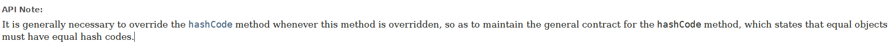
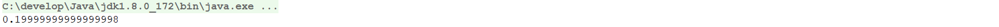

# 1 简答题

## 1.1 简答题一

请分析如下程序是否会报错并说明原因？

|  |
| -------------------------------------------------------------- |

```java
答：声明局部内部类的时候不能有访问说明符，局部类的作用域总是限定在声明这个局部类的块中
```

## 1.2 简答题二

下面lambda表达式的书写是否正确并说明原因？并给出正确的代码！

|  |
| -------------------------------------------------------------- |

```java
答：省略参数类型的时候要一块省略，(a, b) -> a + b
```

## 1.3简答题

请分析如下程序执行完毕以后在控制台的输出结果是什么并说明原因？

|  |
| -------------------------------------------------------------- |

> 答：false(地址值不同) false(equals方法继承自object的[方法](https://docs.oracle.com/en/java/javase/17/docs/api/java.base/java/lang/Object.html#equals(java.lang.Object))，方法体比较地址)



## 1.4 简答题

请分析如下程序执行完毕以后在控制台的输出结果是什么并说明原因？

|  |
| -------------------------------------------------------------- |

```java
答：输出s的地址，输出t的toString返回值
```

## 1.5 简答题

如下程序：

|  |
| -------------------------------------------------------------- |

执行完毕以后在控制台的数据结果为：

|  |
| -------------------------------------------------------------- |

请说明产生该结果的原因，并且给出精确输出(得到结果为0.2)的代码！

```java
答：二进制表达浮点时存在精度损失
```

```java
import java.math.BigDecimal;

/**
 * @Author : eatfi
 * @Date : 2024/12/9 20:38
 */public class Test {
    public static void main(String[] args) {
        double a = 0.01;
        double b = 0.05;
        System.out.println(a / b);
        BigDecimal aBigDecimal = new BigDecimal(String.valueOf(a));
        BigDecimal bBigDecimal = new BigDecimal(String.valueOf(b));
        System.out.println(aBigDecimal.divide(bBigDecimal, 1, BigDecimal.ROUND_HALF_UP).floatValue());
    }
}
```

# .编程题

## 编程题一

.有一个double类型的数组 double[] arr = {1.2, 0.6, 0.01, 3.2, 50.78}

使用BigDecimal求数组中元素的平均值,并保留两位小数(直接截取)

```java
package com.itheima.day04;

import java.math.BigDecimal;
import java.math.RoundingMode;

/**
 * @Author : eatfi
 * @Date : 2024/12/9 20:38
 */public class Test {
    public static void main(String[] args) {
        double[] arr = {1.2, 0.6, 0.01, 3.2, 50.78};
        BigDecimal sumBigdecimal = new BigDecimal(0);
        for(double i : arr){
            sumBigdecimal = sumBigdecimal.add(new BigDecimal(String.valueOf(i)));
        }
        System.out.println(sumBigdecimal.divide(new BigDecimal(String.valueOf(arr.length)), 2 , RoundingMode.DOWN));
    }
}
```

## 编程题二

有一个字符串数组String[] arr = {"Abc", "12a", "10", "150", "你好12", "120"}

需求：求数组中是纯数字值的和

```java
package com.itheima.day04;

import java.math.BigDecimal;
import java.math.RoundingMode;

/**
 * @Author : eatfi
 * @Date : 2024/12/9 20:38
 */public class Test {
    public static void main(String[] args) {
        String[] arr = {"Abc", "12a", "10", "150", "你好12", "120"};
        double sumDouble;
        BigDecimal aBigdecimal = new BigDecimal(0);
        for(String i : arr){
            try{
                aBigdecimal = aBigdecimal.add(new BigDecimal(i));
            }catch(RuntimeException e){
                System.out.println(i);
            };
        }
        System.out.println(aBigdecimal);
    }
}
```