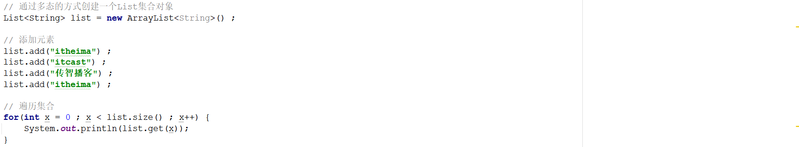
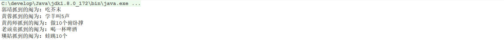

# 1 简答题

## 1.1 简答题一

请说明下述程序执行完毕以后在控制台的输出结果是什么并说明原因？

|  |
| -------------------------------------------------------------- |

```
答：格式不匹配
```

## 1.2 简答题二

简述集合数组的区别？

```java
答：集合在增删的时候可以自动调整长度
```

## 1.3 简答题三

请说明下面程序执行完毕以后在控制台的输出结果是什么并说明原因(从List集合的特点进行作答)？

|  |
| -------------------------------------------------------------- |

```java
答：
```

## 1.4 简答题四

请说明下面程序执行完毕以后在控制台的输出结果是什么并说明原因？如果要进行正常数据的输出应该对程序怎么改造？

```java
// 通过多态的方式创建一个List集合对象
List<String> list = new ArrayList<String>() ;

// 添加元素
list.add("itheima") ;
list.add("itcast") ;
list.add("传智播客") ;
list.add("黑马程序员") ;

// 遍历集合
for(int x = 0 ; x < list.size() ; x++) {
    System.out.println(list.remove(x));
}
```

```
越界异常
```

## 1.5 简答题五

请说明下面程序执行完毕以后在控制台的输出结果是什么并说明原因？

```java
// 通过多态的方式创建一个List集合对象
List<String> list = new ArrayList<String>() ;

// 添加元素
list.add("itheima") ;
list.add("itcast") ;
list.add("传智播客") ;
list.add("itheima") ;

// 获取迭代器对象，通过迭代器对象对集合进行遍历
Iterator<String> iterator = list.iterator();
while(iterator.hasNext()) {

    // 获取元素
    String next = iterator.next();

    // 判断元素
    if(next.equals("itheima")) {
        list.remove(next) ;
    }

}

// 遍历集合
list.forEach( s -> System.out.println(s) );
```

```java
答：要用iterator的remove方法
```

## 1.6 简答题六

去银行办理业务，当银行办理业务人员过多的时候往往需要进行排队。关于排队数据使用哪一种数据结构来进行存储比较合适并说明你的理由？

```
答：linkedlist的pop方法实现先进先出，链表数据结构在增删元素时效率高
```

# 2 编程题

## 2.1 编程题目一

**训练目标**：掌握Java中1.0以及1.8时间日期类的使用，以及理解其在实际开发中的应用

###### 2.1.1定义一个工具类DateUtil，包含两个方法：把日期转换为指定格式的字符串；把字符串解析为指定格式的日期，然后定义一个测试类DateDemo，测试日期工具类的方法.（使用1.0时间日期类完成）

2.1.2 定义一个工具类LocalDateTimeUtil，包含两个方法：把日期转换为指定格式的字符串；把字符串解析为指定格式的日期，然后定义一个测试类LocalDateTimeDemo，测试日期工具类的方法.（使用1.8时间日期类完成）

```java
package com.itheima.day04.wt.demo.demo;

import java.text.ParseException;
import java.text.SimpleDateFormat;
import java.time.LocalDateTime;
import java.time.ZoneId;
import java.time.format.DateTimeFormatter;
import java.util.ArrayList;
import java.util.Date;
import java.util.Iterator;
import java.util.List;

/**
 * @Author : eatfi
 * @Date : 2024/12/10 19:40
 */public class Test {
    public static void main(String[] args) throws ParseException {
        LocalDateTime a = LocalDateTime.now(ZoneId.of("Asia/Shanghai"));

        System.out.println(DateUtil.date2String(a, "yyyy/MM/dd HH:mm:ss"));
        System.out.println(DateUtil.string2Date("2024/06/13 00:00:00", "yyyy/MM/dd HH:mm:ss"));
    }
}
class DateUtil{
    private DateUtil(){}
    public static String date2String(LocalDateTime time, String format) {
        return time.format(DateTimeFormatter.ofPattern(format));
    }

    public static LocalDateTime string2Date(String time, String format){
        return LocalDateTime.parse(time, DateTimeFormatter.ofPattern(format));
    }
}
```

## 2.2 编程题目二

**训练目标**：掌握Java中List集合的使用，以及理解其在实际开发中的应用

**需求背景**："抓阄"是指每人从预先做好记号的纸卷或纸团中摸取一个，以决定做什么。比如：学羊叫5声、蛙跳10个、吃芥末、喝一杯啤酒、做10个俯卧撑等。

**需求描述**：请设计一个抓阄游戏程序，实现5个人的抓阄，程序的运行效果如下所示：

|  |
| -------------------------------------------------------------- |

**实现提示**：

1、创建一个集合存储5个人的名称

2、创建一个集合存储5个阄的内容

3、遍历名称的集合，获取每一个参与人员的名称

4、生成一个随机数作为存储5个阄的集合的索引，从该集合中随机获取一个元素，并且删除获取到的元素

5、在控制台输出结果

```java
package com.itheima.day04.wt.demo.demo;

import java.util.ArrayList;
import java.util.Random;

/**
 * @Author : eatfi
 * @Date : 2024/12/10 21:13
 */
public class RandomTest {
    public static void main(String[] args) {
        ArrayList<String> aArr = new ArrayList<>();
        ArrayList<String> bArr = new ArrayList<>();

        aArr.add("name1");
        aArr.add("name2");
        aArr.add("name3");
        aArr.add("name4");
        aArr.add("name5");

        bArr.add("1");
        bArr.add("2");
        bArr.add("3");
        bArr.add("4");
        bArr.add("5");

        Random rd = new Random();

        for(int i = aArr.size(); i > 0; i--){
            int i1 = rd.nextInt(aArr.size());
            int i2 = rd.nextInt(bArr.size());

            System.out.printf("%s   :   %s\n",aArr.get(i1),bArr.get(i2));
            aArr.remove(i1);
            bArr.remove(i2);
        }

    }
}
```

> name5   :   2
> name1   :   1
> name4   :   3
> name3   :   4
> name2   :   5
