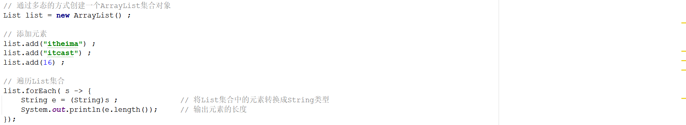
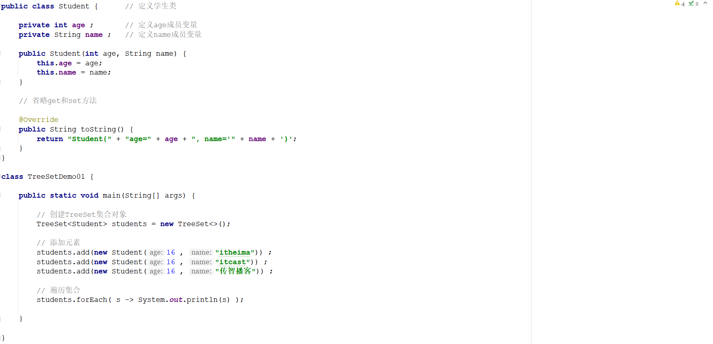
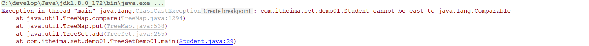
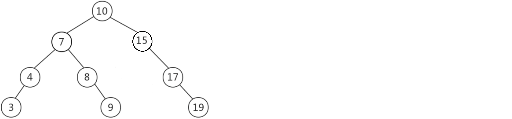
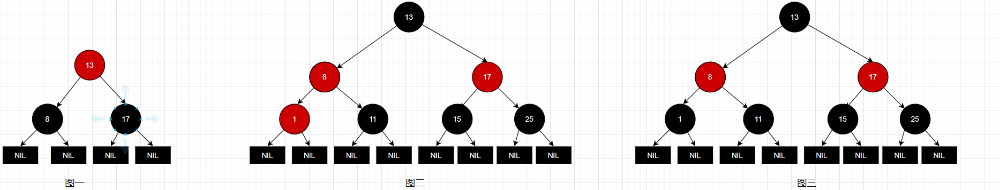
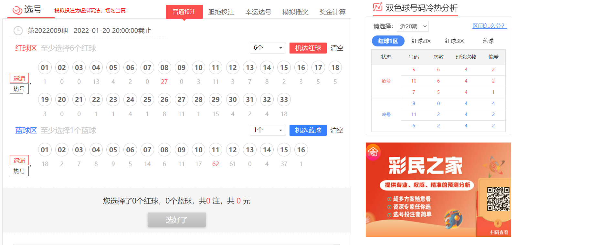
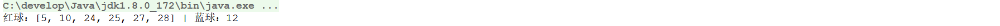

# 1 简答题

## 1.1 简答题一

请分析下面程序的运行结果是什么并说明原因？如果想让错误提前到编译期应该对代码进行如何处理？

|  |
| -------------------------------------------------------------- |

```java
答：类型不匹配，使用范型类
```

## 1.2 简答题二

简述Set集合的特点？

```
答：不重复
```

## 1.3 简答题三

如下程序

|  |
| -------------------------------------------------------------- |

上述程序执行完毕以后会在控制台输出如下错误内容：

|  |
| -------------------------------------------------------------- |

请说明产生该问题的原因？如果想先按照学生的年龄进行从大到小排序，如果年龄相同再按照学生的姓名进行排序，那么可以对代码进行怎样的改造？

```java
答：没有实现comparable接口或comparator比较器
```

```java
public class Student implements comparable{
    ...
    public int compareTo(T o){return this.age - o.age};
}
```

## 1.4 简答题四

下面这棵树是不是一颗平衡二叉树？请说明你分析的依据？如果不是，那么怎么对其进行调整让其成为一颗平衡二叉树？

|  |
| -------------------------------------------------------------- |

```java
答：15结点左右不平衡，进行左旋，15结点变为17结点的左结点，17结点变为10结点的右结点
```

## 1.5 简答题五

下面三棵树，哪一颗是红黑树并说明原因？

|  |
| -------------------------------------------------------------- |

```java
答：3
```

# 2 编程题

## 2.1 编程题目一

**训练目标**：掌握Java中TreeSet集合的使用，以及理解其在实际开发中的应用

**需求背景**：中国福利彩票"双色球"投注区分为红色球号码区和蓝色球号码区，红色球号码区由1-33共三十三个号码组成，蓝色球号码区由1-16共十六个号码组成。如下所示：

|  |
| -------------------------------------------------------------- |

投注时选择6个红色球号码和1个蓝色球号码组成一注进行单式投注，每注金额人民币2元。

**需求描述**：现通过程序模拟双色球随机生成一注号码。程序运行结果如下所示：

|  |
| -------------------------------------------------------------- |

**实现提示**：

1、生成的双色球号码不能重复，因此可以考虑使用TreeSet集合存储双色球号码

2、针对红球的生成，需要生成多次，因此可以考虑使用循环

## 2.2编程题目

使用HashSet和TreeSet,LinkedHashSet存储多个商品信息，遍历并输出;其中商品属性：编号，名称，单价，出版社;要求向其中添加多个相同的商品，验证集合中元素的唯一性。
提示： 向HashSet中添加自定义类的对象信息，需要重写hashCode和equals( )。
向TreeSet中添加自定义类的对象信息，需要实现Comparable接口，指定比较 规则。

## 2.3编程题目

**训练目标**：掌握枚举的定义，以及理解其在实际开发中的应用

**需求背景**：某商场的付款类型有三种：自费、免费、会员权益。在系统中进行记录的时候，往往是通过三个标号进行表示：10131001、10131002、10131003。在给用户进行数据展示的时候，

需要展示标号所对应的中文含义。现通过程序模拟上述需求，如下所示：


| ------------------------------------------------------------ |

上述实现方式存在的弊端：代码看起来比较繁琐，可读性较差，并且不利于后期代码的维护。

**需求描述**：现需要使用枚举对上述程序进行优化。程序的执行效果如下所示：


**实现提示**：

1、定义一个枚举类

2、在枚举类中定义三个枚举项(CHARGE_TYPE_CHARGED、CHARGE_TYPE_FREE、CHARGE_TYPE_MEMBER_RIGHTS)

3、在该枚举类中定义两个属性分别表示标号和付款类型的名称

4、通过构造方法完成属性的初始化

5、定义一个静态方法：根据标号获取付款名称

6、使用枚举优化上述的if...else代码

## 
