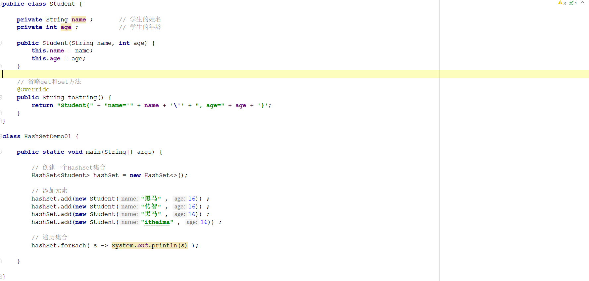
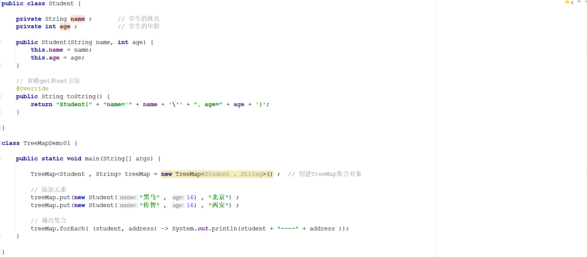
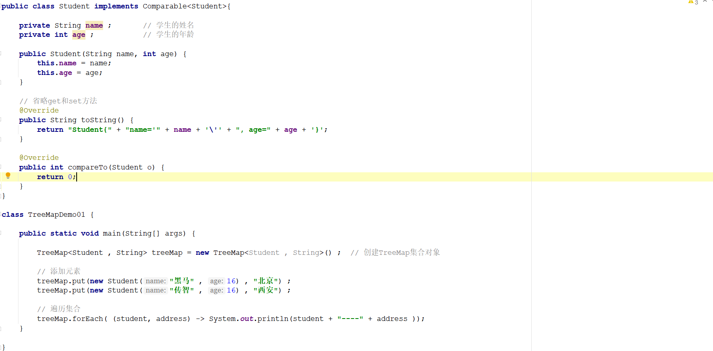
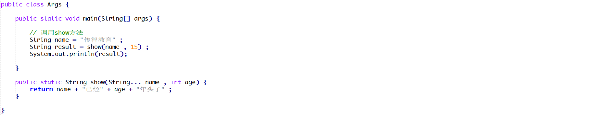
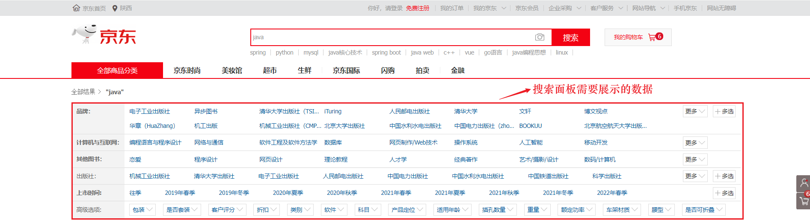

# 1 简答题

## 1.1 简答题一

请说明下述程序执行完成以后会输出几个学生的姓名和年龄并说明原因？如果只想保留一个姓名为"黑马"年龄为16的学生应该怎么处理？【业务要求：如果两个学生对象的姓名和年龄都相同则认为

是同一个对象】

|  |
| -------------------------------------------------------------- |

```java
package com.itheima.day04.wt.demo;

import java.util.HashSet;
import java.util.Objects;

/**
 * @Author : eatfi
 * @Date : 2024/12/13 17:48
 */
public class Student {
    String name;
    int age;
    public static void main(String[] args) {
        HashSet<Student> studentSet = new HashSet<>();
        studentSet.add(new Student("黑马", 16));
        studentSet.add(new Student("传智", 16));
        studentSet.add(new Student("黑马", 16));
        studentSet.add(new Student("itheima", 16));
        studentSet.forEach(System.out::println);
    }
    public Student(String name, int age){
        this.name = name;
        this.age = age;
    }

    @Override
    public boolean equals(Object o) {
        if (this == o) return true;
        if (o == null || getClass() != o.getClass()) return false;
        Student student = (Student) o;
        return age == student.age && Objects.equals(name, student.name);
    }

    @Override
    public int hashCode() {
        return Objects.hash(name, age);
    }

    @Override
    public String toString() {
        return "Student{" +
                "name='" + name + '\'' +
                ", age=" + age +
                '}';
    }
}
```

## 1.2 简答题三

请说明下面程序执行完毕以后在控制台的输出结果是什么？并说明原因？

|  |
| -------------------------------------------------------------- |

```java
答：
```

## 1.3 简答题三

请说明下述程序执行完毕以后在控制台会输出几个元素并且元素的内容是什么？并说明原因？如果想对学生进行先按照年龄从小到大排序，如果年龄相同则按照姓名从小到大进行排序应该怎么实

现？

|  |
| -------------------------------------------------------------- |

```java
答：输出一个
@Override
public int compareTo(Student o) {
    if(this.age.equals(o.age)){
        return this.name.compareTo(o.name);
    }
    else{
        return this.age.compareTo(o.age);
    }
}
```

## 1.4 简答题四

请分析下述程序存在的问题并说明原因？

|  |
| -------------------------------------------------------------- |

```java
答：非可变参数放在可变参数前面
```

```java
package com.itheima.day04.wt;

/**
 * @Author : eatfi
 * @Date : 2024/12/13 19:40
 */
public class Test {
    public static void main(String[] args) {
        String name = "asdf";
        System.out.println(show(10, name, name));
    }
    public static String show(int age, String... name){
        StringBuilder builder = new StringBuilder();
        for(String i : name) {
            builder.append(i);
        }
        String a = builder.toString();
        return a + "己经" + age;
    }
}

```

# 2 编程题

## 2.1 编程题目一

**训练目标**：掌握Java中Map集合的使用，以及理解其在实际开发中的应用

**需求背景**：在京东商城上进行商品搜索的时候，往往会有一个搜索的面板用来展示搜索条件供用户实现按照条件搜索的功能，如下所示：

|  |
| -------------------------------------------------------------- |

**需求描述**: 请选择Java中合适的集合对象来存储上述搜索面板中的数据，并进行遍历。效果如下所示：

|  |
| -------------------------------------------------------------- |

**实现提示**：

1、搜索类别和搜索条件之间存在对应关系，可以考虑使用Map集合进行存储

2、一个搜索类别对应多个搜索条件并且不能重复，因此搜索条件可以考虑使用Set集合进行存储

2.2 编程题2

电脑=[华为电脑, 苹果电脑, oppo电脑, vivo电脑, 三星电脑]
手机=[华为手机, 苹果手机, oppo手机, vivo手机, 三星手机]
耳机=[华为耳机, 苹果耳机, 华强北耳机, oppo耳机, vivo耳机, 三星耳机]

现有三种产品,每种品牌对应几种商品,要求选择合适的集合来存储,并按照上述格式打印在控制台

2.3 训练描述：【ArrayList类、HashMap】
一、 需求说明：ArrayList集合嵌套HashMap集合并遍历。
定义一个ArrayList集合，它包含三个元素，每一个元素都是HashMap类型的。每一个HashMap集合的键和值都是String类型的，
键：String 丈夫的姓名
值：String 妻子的姓名
给出如下的字符串数据，请用代码实现需求。
第一个HashMap集合的元素：
孙策 大乔
周瑜 小乔
第二个HashMap集合的元素：
郭靖 黄蓉
杨过 小龙女
第三个HashMap集合的元素：
令狐冲 任盈盈
林平之 岳灵珊
